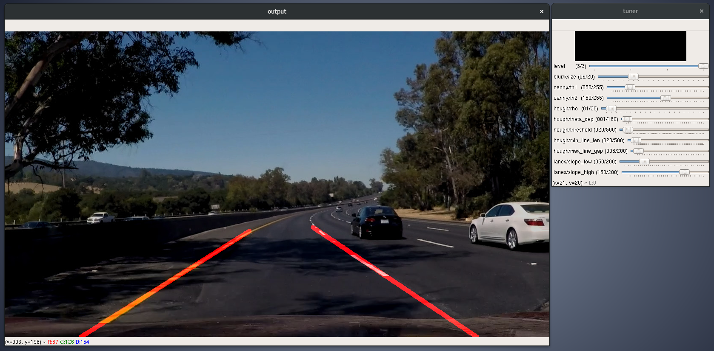

# **Finding Lane Lines on the Road** 

The goal of this project is to detect lane lines in images and videos using Python and OpenCV.

## Reflection

### Pipeline
My pipeline works as follows:
1. Convert image to grayscale.
2. Reduce image noise using Gaussian blur.
3. Apply Canny edge detection.
4. Mask region of interest.
5. Find line segments with Hough line transform.
6. Separate and filter line segments by their slope.
7. Fit line segments into single lines.

When fitting line segments into single lines, I have found it more convenient to turn around line equation so that *x* is dependent on *y*.

I made my pipeline more robust on videos by averaging line coefficients over last N frames.

I made a [visual tool](./tune_params.py) to help me better understand hyperparameters:

### Potential shortcomings
My current pipeline might not work well with curvy or otherwise sophisticated roads since it approximates lane markings as straight lines.

Another potential shortcoming could be sensitivity to camera angle due to reliance on the region of interest mask.

### Possible improvements
A possible improvement would be to fit line segments into a curve instead of a straight line.

Also, it might be useful to estimate the probability of extrapolated lane lines being correct.
